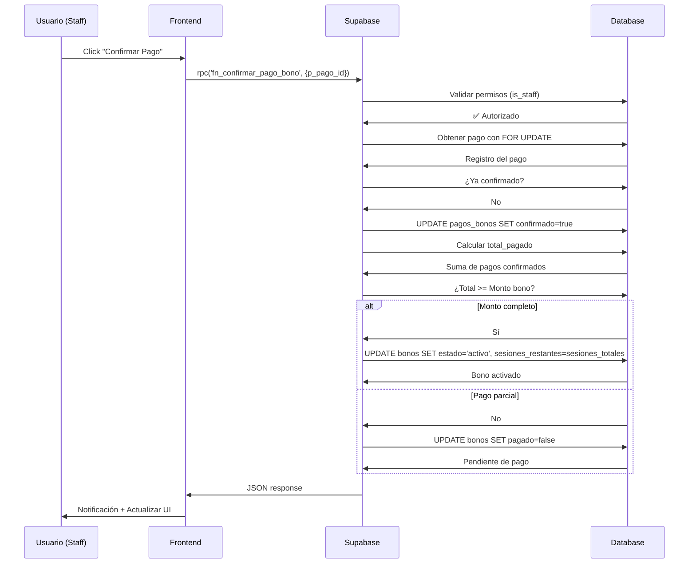

# 💳 RPC: Confirmar Pago de Bono

## 📋 Descripción

Función RPC segura para confirmar pagos de bonos desde el frontend. Valida permisos, actualiza el estado del pago y activa el bono automáticamente cuando el monto está cubierto.

---

## 🔧 Función SQL

```sql
public.fn_confirmar_pago_bono(p_pago_id uuid)
```

### Características

✅ **Seguridad**: Solo personal autorizado (staff) puede ejecutarla  
✅ **Transaccional**: Garantiza consistencia de datos  
✅ **Idempotente**: No permite confirmar el mismo pago dos veces  
✅ **Inteligente**: Maneja pagos parciales correctamente  
✅ **Automática**: Activa el bono cuando se cubre el monto total  
✅ **Inicialización**: Establece `sesiones_restantes = sesiones_totales` si es NULL  

---

## 📥 Parámetros

| Parámetro | Tipo | Requerido | Descripción |
|-----------|------|-----------|-------------|
| `p_pago_id` | `uuid` | ✅ Sí | ID del registro en `pagos_bonos` a confirmar |

---

## 📤 Retorno

Retorna un objeto `jsonb` con la siguiente estructura:

### ✅ Caso de Éxito (Bono Activado)

```json
{
  "success": true,
  "mensaje": "Pago confirmado y bono activado exitosamente",
  "pago": {
    "id": "uuid-del-pago",
    "monto": 1500.00,
    "confirmado_por": "uuid-del-usuario",
    "fecha_confirmacion": "2025-10-27T14:30:00Z"
  },
  "bono": {
    "id": "uuid-del-bono",
    "estado": "activo",
    "pagado": true,
    "total_pagado": 1500.00,
    "monto_bono": 1500.00,
    "sesiones_restantes": 8,
    "sesiones_totales": 8
  }
}
```

### ⚠️ Caso de Éxito (Pago Parcial)

```json
{
  "success": true,
  "mensaje": "Pago confirmado. Pago parcial registrado",
  "pago": {
    "id": "uuid-del-pago",
    "monto": 500.00,
    "confirmado_por": "uuid-del-usuario",
    "fecha_confirmacion": "2025-10-27T14:30:00Z"
  },
  "bono": {
    "id": "uuid-del-bono",
    "estado": "pendiente",
    "pagado": false,
    "total_pagado": 500.00,
    "monto_bono": 1500.00,
    "monto_pendiente": 1000.00
  }
}
```

### ❌ Caso de Error

```json
{
  "success": false,
  "error": "Descripción del error",
  "mensaje": "Mensaje amigable para el usuario"
}
```

**Errores comunes:**
- `"Permisos insuficientes"` → Usuario no es staff
- `"Pago no encontrado"` → ID de pago inválido
- `"Pago ya confirmado"` → Intento de confirmar pago ya procesado
- `"Bono no encontrado"` → Bono asociado no existe

---

## 💻 Uso desde Frontend (Nuxt 3 / Supabase)

### Ejemplo Básico

```typescript
// composables/useBonos.ts
export const useBonos = () => {
  const supabase = useSupabaseClient()

  const confirmarPago = async (pagoId: string) => {
    try {
      const { data, error } = await supabase.rpc('fn_confirmar_pago_bono', {
        p_pago_id: pagoId
      })

      if (error) throw error

      // Verificar respuesta
      if (data.success) {
        console.log('✅', data.mensaje)
        return data
      } else {
        console.error('❌', data.error)
        throw new Error(data.mensaje)
      }
    } catch (err) {
      console.error('Error al confirmar pago:', err)
      throw err
    }
  }

  return {
    confirmarPago
  }
}
```

### Uso en Componente

```vue
<script setup lang="ts">
const { confirmarPago } = useBonos()
const loading = ref(false)

const handleConfirmarPago = async (pagoId: string) => {
  loading.value = true
  
  try {
    const resultado = await confirmarPago(pagoId)
    
    // Mostrar notificación según el caso
    if (resultado.bono.estado === 'activo') {
      useToast().success('Pago confirmado. Bono activado exitosamente')
    } else if (resultado.bono.monto_pendiente) {
      useToast().warning(
        `Pago parcial confirmado. Pendiente: $${resultado.bono.monto_pendiente}`
      )
    }
    
    // Actualizar UI o recargar datos
    await refrescarDatos()
    
  } catch (error) {
    useToast().error('Error al confirmar el pago')
  } finally {
    loading.value = false
  }
}
</script>

<template>
  <UButton 
    @click="handleConfirmarPago(pago.id)"
    :loading="loading"
    color="green"
  >
    Confirmar Pago
  </UButton>
</template>
```

### Manejo de Estados

```typescript
const procesarResultado = (resultado: any) => {
  const { bono, pago } = resultado

  switch (bono.estado) {
    case 'activo':
      // Bono activado, cliente puede agendar citas
      return {
        tipo: 'success',
        mensaje: `¡Bono activado! Quedan ${bono.sesiones_restantes} sesiones disponibles`,
        accion: 'agendar_cita'
      }

    case 'pendiente':
      // Pago parcial, falta completar
      const porcentajePagado = (bono.total_pagado / bono.monto_bono) * 100
      return {
        tipo: 'warning',
        mensaje: `Pago parcial: ${porcentajePagado.toFixed(0)}% completado`,
        accion: 'agregar_pago',
        montoPendiente: bono.monto_pendiente
      }

    default:
      return {
        tipo: 'info',
        mensaje: `Pago confirmado. Estado del bono: ${bono.estado}`,
        accion: null
      }
  }
}
```

---

## 🔐 Seguridad y Permisos

### Row Level Security (RLS)

La función tiene `SECURITY DEFINER`, lo que significa que se ejecuta con privilegios elevados. Sin embargo, incluye validación interna:

```sql
IF NOT public.is_staff() THEN
    RETURN jsonb_build_object(
        'success', false,
        'error', 'Permisos insuficientes',
        ...
    );
END IF;
```

### Políticas RLS en `pagos_bonos`

```sql
-- Solo staff puede confirmar pagos
CREATE POLICY "rls_pagos_bonos_staff_gestionar"
ON public.pagos_bonos FOR ALL
TO authenticated
USING (public.is_staff())
WITH CHECK (public.is_staff());
```

### Validación en Frontend

```typescript
// Verificar rol antes de mostrar botón
const { user } = useSupabaseUser()
const esStaff = computed(() => 
  user.value?.user_metadata?.rol === 'coordinacion' ||
  user.value?.user_metadata?.rol === 'admin'
)
```

```vue
<UButton 
  v-if="esStaff"
  @click="confirmarPago(pago.id)"
>
  Confirmar Pago
</UButton>
```

---

## 🔄 Flujo Completo



---

## 🧪 Testing

### Caso 1: Pago Completo

```sql
-- 1. Crear bono pendiente
INSERT INTO bonos (paciente_id, monto, sesiones_totales, estado)
VALUES ('uuid-paciente', 1500, 8, 'pendiente');

-- 2. Registrar pago completo
INSERT INTO pagos_bonos (bono_id, monto, metodo_pago, confirmado)
VALUES ('uuid-bono', 1500, 'transferencia', false);

-- 3. Confirmar vía RPC
SELECT fn_confirmar_pago_bono('uuid-pago');

-- Resultado esperado:
-- ✅ success: true
-- ✅ bono.estado: 'activo'
-- ✅ bono.sesiones_restantes: 8
```

### Caso 2: Pago Parcial

```sql
-- 1. Bono de $1500
INSERT INTO bonos (paciente_id, monto, sesiones_totales, estado)
VALUES ('uuid-paciente', 1500, 8, 'pendiente');

-- 2. Primer pago de $500
INSERT INTO pagos_bonos (bono_id, monto, metodo_pago)
VALUES ('uuid-bono', 500, 'transferencia');

SELECT fn_confirmar_pago_bono('uuid-pago-1');
-- Resultado: estado='pendiente', monto_pendiente=1000

-- 3. Segundo pago de $1000
INSERT INTO pagos_bonos (bono_id, monto, metodo_pago)
VALUES ('uuid-bono', 1000, 'tarjeta');

SELECT fn_confirmar_pago_bono('uuid-pago-2');
-- Resultado: estado='activo', total_pagado=1500
```

### Caso 3: Prevención de Confirmación Duplicada

```sql
-- 1. Confirmar pago
SELECT fn_confirmar_pago_bono('uuid-pago');

-- 2. Intentar confirmar nuevamente
SELECT fn_confirmar_pago_bono('uuid-pago');

-- Resultado esperado:
-- ❌ success: false
-- ❌ error: "Pago ya confirmado"
```

---

## 📊 Monitoreo y Logs

### Ver Logs en Supabase

```sql
-- Filtrar logs de confirmaciones
SELECT * FROM logs 
WHERE message LIKE '%Pago % confirmado%'
ORDER BY created_at DESC
LIMIT 50;
```

### Notificaciones PostgreSQL

La función genera `RAISE NOTICE` que aparecen en los logs:

```
✅ Pago abc-123 confirmado. Bono xyz-456 activado (total pagado: 1500 de 1500)
ℹ️ Pago abc-124 confirmado. Pago parcial: 500 de 1500 (falta: 1000)
```

---

## 🔧 Troubleshooting

### Error: "Permisos insuficientes"

**Causa**: Usuario no tiene rol de staff  
**Solución**: Verificar `is_staff()` y metadata del usuario

```sql
SELECT public.is_staff(); -- Debe retornar true
SELECT auth.uid(); -- Verificar usuario autenticado
```

### Error: "Pago no encontrado"

**Causa**: UUID incorrecto o registro no existe  
**Solución**: Verificar existencia del pago

```sql
SELECT * FROM pagos_bonos WHERE id = 'uuid-del-pago';
```

### Bono no se activa

**Causa**: Monto pagado < monto del bono  
**Solución**: Verificar suma de pagos

```sql
SELECT 
    b.id, 
    b.monto as monto_bono,
    COALESCE(SUM(p.monto), 0) as total_pagado
FROM bonos b
LEFT JOIN pagos_bonos p ON p.bono_id = b.id AND p.confirmado = true
WHERE b.id = 'uuid-del-bono'
GROUP BY b.id, b.monto;
```

---

## 📚 Referencias

- **Archivo SQL**: `/supabase/migrations/20251027_bonos_logica_negocio.sql` (Sección 3)
- **Documentación General**: `BONOS_SISTEMA_COMPLETADO.md`
- **Guía de RLS**: `BONOS_INTEGRACION_AGENDA.md`

---

## ✅ Checklist de Implementación

- [x] Función SQL creada y migrada
- [x] GRANT EXECUTE otorgado a authenticated
- [x] RLS configurado en pagos_bonos
- [ ] Composable `useBonos.ts` con `confirmarPago()`
- [ ] Componente de confirmación de pagos
- [ ] Manejo de estados (activo/parcial/error)
- [ ] Notificaciones toast para feedback
- [ ] Testing en staging
- [ ] Documentación para equipo
- [ ] Deploy a producción

---

**Última actualización**: 27 de octubre de 2025  
**Versión**: 1.0  
**Autor**: Sistema de Bonos - PsicologaKarem
