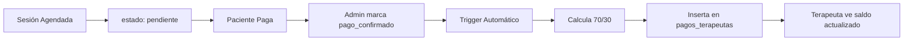

# 💰 Módulo de Sesiones - Sistema de Gestión Financiera

> Panel de transparencia financiera para terapeutas de Psicóloga Karem

## 🎯 ¿Qué es este módulo?

Un sistema completo de gestión y visualización financiera que permite a los terapeutas:

✅ Ver todas sus sesiones (pasadas y futuras)  
✅ Consultar el estado de cada sesión  
✅ Conocer su compensación (70% del precio)  
✅ Visualizar su saldo acumulado  
✅ Filtrar por mes y estado  
✅ Ver estadísticas en tiempo real  

## 📦 Contenido del Módulo

### Archivos Principales
```
📁 composables/
  └── useSesiones.ts                          # Lógica de negocio

📁 components/
  ├── ResumenCard.vue                         # Cards de métricas
  └── TablaSesiones.vue                       # Tabla responsive

📁 pages/terapeuta/
  └── sesiones.vue                            # Página principal

📁 supabase/migrations/
  └── 20251019_modulo_sesiones_financiero.sql # Schema de BD

📁 Documentación/
  ├── SESIONES_MODULO_DOCUMENTACION.md        # Docs completas
  ├── SESIONES_GUIA_RAPIDA.md                 # Quick Start
  ├── SESIONES_DATOS_PRUEBA.md                # Testing data
  └── SESIONES_README.md                      # Este archivo
```

## 🚀 Quick Start

### 1. Aplicar Migración SQL (5 min)
```sql
-- En Supabase Dashboard → SQL Editor
-- Ejecutar: supabase/migrations/20251019_modulo_sesiones_financiero.sql
```

### 2. Verificar Instalación
```sql
-- Verificar que las tablas existen:
SELECT * FROM sesiones LIMIT 1;
SELECT * FROM pagos_terapeutas LIMIT 1;
```

### 3. Probar en el Frontend
```bash
npm run dev
```
Navegar a: `http://localhost:3000/terapeuta/sesiones`

## 💡 Características Destacadas

### 🎨 Interfaz Clara y Profesional
- Cards visuales con métricas financieras
- Tabla responsive (desktop y mobile)
- Filtros por estado y mes
- Animaciones suaves
- Emojis intuitivos por estado

### 💰 Cálculos Automáticos
- **70%** para el terapeuta
- **30%** para la consulta
- Triggers automáticos en base de datos
- Actualización en tiempo real

### 🔒 Seguridad Total
- Row Level Security (RLS)
- Terapeutas solo ven sus datos
- Privacidad del paciente (solo iniciales)
- Auditoría completa

## 📊 Modelo de Datos

### Tabla: sesiones
```typescript
{
  id: uuid
  paciente_id: uuid
  terapeuta_id: uuid
  fecha: timestamp
  estado: 'pendiente' | 'confirmada' | 'anulada' | 'completada'
  modalidad: 'online' | 'presencial'
  precio_total: number
  pago_confirmado: boolean
  observaciones: string
}
```

### Tabla: pagos_terapeutas
```typescript
{
  id: uuid
  terapeuta_id: uuid
  sesion_id: uuid
  monto_terapeuta: number  // 70%
  monto_consulta: number   // 30%
  estado_pago: 'pendiente' | 'confirmado' | 'pagado'
  fecha_pago: timestamp
}
```

## 🔄 Flujo de Trabajo



## 💻 Uso del Composable

```typescript
import { useSesiones } from '~/composables/useSesiones'

const { 
  obtenerSesiones,
  calcularResumenFinanciero,
  formatearMonto
} = useSesiones()

// Obtener sesiones
const sesiones = await obtenerSesiones()

// Con filtros
const filtradas = await obtenerSesiones({
  estado: 'confirmada',
  mes: 10,
  anio: 2025
})

// Calcular resumen
const resumen = calcularResumenFinanciero(sesiones)
console.log(resumen.montoTerapeuta) // Total del terapeuta
```

## 🎨 Componentes

### ResumenCard
```vue
<ResumenCard
  title="Confirmadas"
  :count="10"
  :amount="350.00"
  color="green"
  emoji="💚"
  subtitle="Ingresos asegurados"
/>
```

### TablaSesiones
```vue
<TablaSesiones :sesiones="sesiones" />
```

## 🐛 Troubleshooting

### Sesiones no aparecen
✅ Verificar que `terapeuta_id` coincide con `auth.uid()`  
✅ Comprobar políticas RLS  
✅ Ver errores en consola del navegador  

### Montos incorrectos
✅ Verificar que `precio_total` es numérico  
✅ Comprobar trigger `registrar_pago_terapeuta`  
✅ Revisar cálculo 70/30 en el composable  

### Filtros no funcionan
✅ Verificar refs en el componente  
✅ Comprobar computed de sesiones filtradas  
✅ Revisar errores de TypeScript  

## 📚 Documentación Completa

- **Guía Completa**: [`SESIONES_MODULO_DOCUMENTACION.md`](./SESIONES_MODULO_DOCUMENTACION.md)
- **Quick Start**: [`SESIONES_GUIA_RAPIDA.md`](./SESIONES_GUIA_RAPIDA.md)
- **Testing**: [`SESIONES_DATOS_PRUEBA.md`](./SESIONES_DATOS_PRUEBA.md)

## 🔐 Seguridad

### Políticas RLS Implementadas

```sql
-- Terapeutas solo ven sus sesiones
CREATE POLICY "Terapeutas ver propias sesiones"
  ON sesiones FOR SELECT
  USING (terapeuta_id = auth.uid());

-- Solo admin puede confirmar pagos
CREATE POLICY "Admin gestiona pagos"
  ON pagos_terapeutas FOR ALL
  USING (is_admin_or_coord());
```

## 📈 Métricas del Panel

| Métrica | Descripción | Cálculo |
|---------|-------------|---------|
| **Promedio por sesión** | Ingreso medio | `total / confirmadas` |
| **Tasa de confirmación** | % de éxito | `(confirmadas / total) * 100` |
| **Ingresos potenciales** | Por confirmar | `sum(pendientes) * 0.70` |

## 🎯 Filosofía del Módulo

### Transparencia Total
> Visibilidad completa de ingresos, cálculos claros, historial accesible

### Respeto y Confianza
> Privacidad del paciente, datos protegidos, comunicación directa

### Bienestar Profesional
> Interfaz amigable, cálculos automáticos, seguridad económica

## 🛠️ Stack Tecnológico

- **Frontend**: Nuxt 3 + Vue 3 + TypeScript
- **Estilos**: TailwindCSS
- **Base de Datos**: Supabase (PostgreSQL)
- **Autenticación**: Supabase Auth
- **Seguridad**: Row Level Security (RLS)

## 📞 Soporte

**Dudas de pagos**: admin@psicologakarem.com  
**Soporte técnico**: Equipo de desarrollo  
**Bugs**: Sistema de gestión interno  

## ✨ Próximas Mejoras

- [ ] Exportar reportes en PDF
- [ ] Gráficos de evolución mensual
- [ ] Notificaciones push
- [ ] Calculadora de proyecciones
- [ ] Integración con facturación

## 📝 Changelog

### v1.0.0 (19/10/2025)
- ✅ Módulo completo de sesiones
- ✅ Gestión financiera 70/30
- ✅ Triggers automáticos
- ✅ RLS y seguridad
- ✅ UI responsive
- ✅ Documentación completa

## 🤝 Contribuciones

Este módulo es parte del sistema privado de Psicóloga Karem.  
Para cambios o mejoras, contactar con el equipo de desarrollo.

---

## 🎓 Conceptos Clave

### ¿Qué es el 70/30?
**70%** → Terapeuta (trabajo directo y expertise)  
**30%** → Consulta (plataforma, administración, coordinación)

### ¿Cuándo se confirma un pago?
Cuando **Belmaris** verifica el pago del paciente y marca `pago_confirmado=true`

### ¿Cuándo se recibe la compensación?
**1-5 de cada mes**: Procesamiento de pagos confirmados del mes anterior

---

<div align="center">

**Construido con ❤️ para el equipo de Psicóloga Karem**

*Sistema de gestión clínica profesional*

</div>
