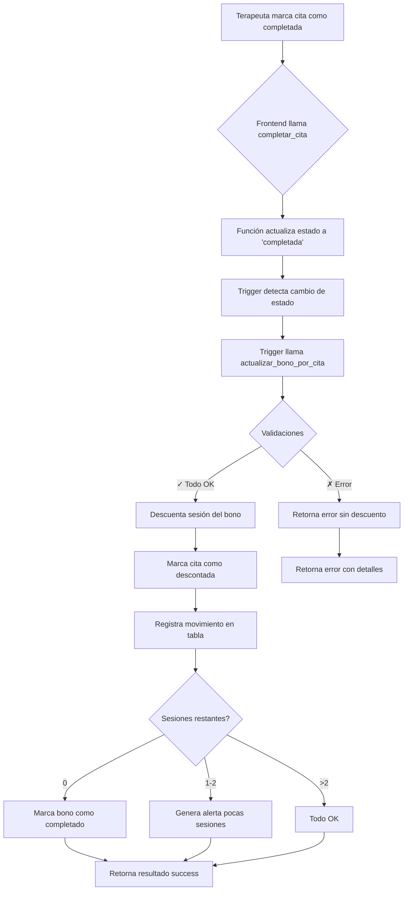

# 🎯 Sistema de Gestión de Citas y Bonos - Guía Completa

> **Sistema robusto y consolidado para gestionar citas con descuento automático de sesiones de bonos**

---

## 📋 Tabla de Contenidos

1. [Visión General](#-visión-general)
2. [Arquitectura del Sistema](#-arquitectura-del-sistema)
3. [Componentes Principales](#-componentes-principales)
4. [Flujo de Trabajo](#-flujo-de-trabajo)
5. [Uso en Frontend](#-uso-en-frontend)
6. [Casos de Uso](#-casos-de-uso)
7. [Validaciones y Seguridad](#-validaciones-y-seguridad)
8. [Trazabilidad](#-trazabilidad)
9. [Mantenimiento](#-mantenimiento)
10. [Troubleshooting](#-troubleshooting)

---

## 🎨 Visión General

### Objetivo

Diseñar un sistema de gestión de citas robusto y conectado con los bonos activos, que:

✅ **Descuenta automáticamente** sesiones del bono cuando una cita se marca como "completada"  
✅ **Evita doble descuento** si la cita cambia de estado varias veces  
✅ **Mantiene sincronizadas** las relaciones entre pacientes, terapeutas, citas y bonos  
✅ **Permite gestión completa** desde la agenda del terapeuta  
✅ **Es resiliente** y no rompe la aplicación aunque falle un trigger o un fetch  

### Características Principales

- 🔄 **Idempotencia**: No importa cuántas veces se ejecute, nunca descuenta dos veces
- 📊 **Trazabilidad**: Registro completo de todos los movimientos
- 🔒 **Seguridad**: RLS configurado para proteger datos sensibles
- ⚡ **Performance**: Índices optimizados para consultas rápidas
- 🎯 **Alertas**: Notificaciones automáticas cuando quedan pocas sesiones
- 🛡️ **Validaciones**: Validación exhaustiva en cada paso

---

## 🏗️ Arquitectura del Sistema

### Diagrama de Relaciones

```
┌─────────────┐         ┌──────────────┐         ┌─────────────┐
│  PACIENTES  │────────▶│    CITAS     │────────▶│   BONOS     │
└─────────────┘         └──────────────┘         └─────────────┘
       │                       │                         │
       │                       │                         │
       ▼                       ▼                         ▼
┌─────────────┐         ┌──────────────┐         ┌─────────────┐
│ TERAPEUTAS  │         │   SESIONES   │         │ MOVIMIENTOS │
└─────────────┘         └──────────────┘         └─────────────┘
```

### Tablas Principales

| Tabla | Propósito | Campos Clave |
|-------|-----------|--------------|
| **citas** | Registro de sesiones programadas | `paciente_id`, `terapeuta_id`, `bono_id`, `estado`, `sesion_descontada`, `consumo_registrado` |
| **bonos** | Control de sesiones totales/restantes | `sesiones_restantes`, `sesiones_totales`, `estado`, `paciente_id` |
| **movimientos_bonos** | Trazabilidad de todos los cambios | `bono_id`, `cita_id`, `sesiones_antes`, `sesiones_despues`, `tipo_movimiento` |
| **pacientes** | Datos del cliente | `id`, `nombre_completo`, `email`, `terapeuta_id` |
| **terapeutas** | Datos del profesional | `id`, `nombre_completo`, `email` |

---

## ⚙️ Componentes Principales

### 1. Tabla `movimientos_bonos`

**Propósito**: Registro inmutable de todos los cambios en bonos para auditoría completa.

```sql
CREATE TABLE public.movimientos_bonos (
    id uuid PRIMARY KEY,
    bono_id uuid NOT NULL,
    cita_id uuid,
    paciente_id uuid NOT NULL,
    terapeuta_id uuid,
    tipo_movimiento text CHECK (tipo_movimiento IN ('descuento', 'reembolso', 'ajuste', 'creacion', 'cancelacion')),
    sesiones_antes integer NOT NULL,
    sesiones_despues integer NOT NULL,
    sesiones_modificadas integer GENERATED ALWAYS AS (sesiones_antes - sesiones_despues) STORED,
    motivo text,
    metadata jsonb DEFAULT '{}',
    created_at timestamptz NOT NULL DEFAULT now(),
    created_by uuid
);
```

**Tipos de Movimiento**:
- `descuento`: Uso normal de sesión por cita completada
- `reembolso`: Devolución de sesión (ej: cita cancelada después)
- `ajuste`: Corrección manual por coordinadora
- `creacion`: Registro inicial al crear bono
- `cancelacion`: Anulación de bono

---

### 2. Función `actualizar_bono_por_cita()`

**Propósito**: Función principal que descuenta una sesión del bono con todas las validaciones.

**Firma**:
```sql
public.actualizar_bono_por_cita(p_cita_id uuid) RETURNS jsonb
```

**Validaciones**:
1. ✅ Usuario autenticado
2. ✅ Cita existe
3. ✅ Tiene bono asociado
4. ✅ Cita está en estado `completada` o `realizada`
5. ✅ No se ha descontado previamente (idempotencia)
6. ✅ Bono existe y está activo
7. ✅ Bono tiene sesiones disponibles
8. ✅ Paciente del bono coincide con el de la cita

**Resultado**:
```json
{
  "success": true,
  "message": "Sesión descontada correctamente",
  "cita_id": "uuid",
  "bono_id": "uuid",
  "sesiones_antes": 8,
  "sesiones_despues": 7,
  "sesiones_totales": 8,
  "bono_completado": false,
  "alerta": true,
  "tipo_alerta": "pocas_sesiones",
  "mensaje_alerta": "⚠️ Quedan solo 7 sesiones - Informar al paciente"
}
```

---

### 3. Trigger `trg_actualizar_bono_por_cita`

**Propósito**: Ejecuta automáticamente el descuento cuando una cita cambia a estado completada.

**Condiciones de Activación**:
- Estado cambió a `completada` o `realizada`
- Tiene `bono_id` asociado
- No se ha descontado previamente (`sesion_descontada = false`)
- No se ha registrado consumo (`consumo_registrado = false`)

**Momento**: `BEFORE UPDATE` en la tabla `citas`

---

### 4. Función RPC `completar_cita()`

**Propósito**: Endpoint seguro para que el frontend marque citas como completadas.

**Uso**:
```typescript
const { data, error } = await supabase.rpc('completar_cita', {
  p_cita_id: citaId
});

if (data?.success) {
  toast.success('Cita completada y sesión descontada');
} else {
  toast.error(data?.message || 'Error al completar cita');
}
```

**Validaciones**:
- Usuario autenticado
- Rol de terapeuta o coordinadora
- Cita existe

---

### 5. Funciones Auxiliares

#### `obtener_historial_bono(p_bono_id uuid)`

Obtiene el historial completo de movimientos de un bono.

```typescript
const { data: historial, error } = await supabase.rpc('obtener_historial_bono', {
  p_bono_id: bonoId
});

// Resultado:
// [
//   {
//     id: 'uuid',
//     tipo_movimiento: 'descuento',
//     sesiones_antes: 8,
//     sesiones_despues: 7,
//     sesiones_modificadas: 1,
//     motivo: 'Descuento automático por cita completada',
//     fecha: '2025-10-28T10:30:00Z',
//     cita_id: 'uuid',
//     metadata: { fecha_cita: '2025-10-28', ... }
//   },
//   ...
// ]
```

#### `verificar_bono_citas(p_bono_id uuid)`

Verifica el estado de un bono y detecta inconsistencias.

```typescript
const { data: verificacion, error } = await supabase.rpc('verificar_bono_citas', {
  p_bono_id: bonoId
});

// Resultado:
// {
//   success: true,
//   bono: {
//     id: 'uuid',
//     sesiones_totales: 8,
//     sesiones_restantes: 5,
//     sesiones_usadas: 3,
//     estado: 'activo',
//     paciente_id: 'uuid'
//   },
//   citas: {
//     completadas: 3,
//     pendientes: 2,
//     total: 5
//   },
//   alerta: false  // true si hay inconsistencias
// }
```

#### `verificar_sistema_citas_bonos()`

Verifica que todos los componentes estén correctamente instalados.

```sql
SELECT * FROM public.verificar_sistema_citas_bonos();
```

---

## 🔄 Flujo de Trabajo

### Flujo Completo de Descuento de Sesión



### Secuencia de Operaciones

1. **Frontend**: Usuario marca cita como completada
2. **RPC**: `completar_cita()` valida permisos
3. **Update**: Cambia estado de cita a `completada`
4. **Trigger**: Detecta cambio y ejecuta función
5. **Validación**: Verifica todas las condiciones
6. **Descuento**: Actualiza `sesiones_restantes` en bono
7. **Marcado**: Establece flags `sesion_descontada` y `consumo_registrado`
8. **Logging**: Inserta registro en `movimientos_bonos`
9. **Estado**: Si `sesiones_restantes = 0`, marca bono como `completado`
10. **Respuesta**: Retorna resultado con alertas si aplica

---

## 💻 Uso en Frontend

### Instalación

Primero, ejecuta la migración:

```bash
# Conecta a tu proyecto de Supabase
supabase db push

# O aplica la migración específica
supabase migration up --db-url [TU_DB_URL] 20251028_sistema_citas_bonos_consolidado
```

### Ejemplo Completo en Vue/Nuxt

#### 1. Composable para Gestión de Citas

```typescript
// composables/useCitas.ts
import { useSupabaseClient } from '#imports'

export const useCitas = () => {
  const supabase = useSupabaseClient()

  /**
   * Marca una cita como completada y descuenta automáticamente del bono
   */
  const completarCita = async (citaId: string) => {
    try {
      const { data, error } = await supabase.rpc('completar_cita', {
        p_cita_id: citaId
      })

      if (error) throw error

      if (!data?.success) {
        throw new Error(data?.message || 'Error al completar cita')
      }

      // Mostrar alerta si hay
      if (data.alerta) {
        console.warn(data.mensaje_alerta)
      }

      return data
    } catch (error) {
      console.error('Error al completar cita:', error)
      throw error
    }
  }

  /**
   * Obtiene el historial de movimientos de un bono
   */
  const obtenerHistorialBono = async (bonoId: string) => {
    try {
      const { data, error } = await supabase.rpc('obtener_historial_bono', {
        p_bono_id: bonoId
      })

      if (error) throw error

      return data
    } catch (error) {
      console.error('Error al obtener historial:', error)
      throw error
    }
  }

  /**
   * Verifica el estado de un bono y sus citas
   */
  const verificarBono = async (bonoId: string) => {
    try {
      const { data, error } = await supabase.rpc('verificar_bono_citas', {
        p_bono_id: bonoId
      })

      if (error) throw error

      return data
    } catch (error) {
      console.error('Error al verificar bono:', error)
      throw error
    }
  }

  /**
   * Obtiene citas pendientes de un terapeuta
   */
  const obtenerCitasPendientes = async (terapeutaId: string) => {
    const { data, error } = await supabase
      .from('citas')
      .select(`
        *,
        paciente:pacientes(*),
        bono:bonos(*)
      `)
      .eq('terapeuta_id', terapeutaId)
      .in('estado', ['pendiente', 'confirmada'])
      .order('fecha_cita', { ascending: true })
      .order('hora_inicio', { ascending: true })

    if (error) throw error
    return data
  }

  return {
    completarCita,
    obtenerHistorialBono,
    verificarBono,
    obtenerCitasPendientes
  }
}
```

#### 2. Componente de Agenda

```vue
<template>
  <div class="agenda-terapeuta">
    <h2>Agenda del Día</h2>
    
    <div v-for="cita in citas" :key="cita.id" class="cita-card">
      <div class="cita-info">
        <h3>{{ cita.paciente.nombre_completo }}</h3>
        <p>{{ formatHora(cita.hora_inicio) }} - {{ formatHora(cita.hora_fin) }}</p>
        
        <!-- Info del bono si existe -->
        <div v-if="cita.bono" class="bono-info">
          <span class="badge">
            Bono: {{ cita.bono.sesiones_restantes }} / {{ cita.bono.sesiones_totales }} sesiones
          </span>
          
          <!-- Alerta si quedan pocas sesiones -->
          <span v-if="cita.bono.sesiones_restantes <= 2" class="badge warning">
            ⚠️ Pocas sesiones
          </span>
        </div>
      </div>

      <div class="cita-acciones">
        <button 
          v-if="cita.estado === 'confirmada'"
          @click="completar(cita.id)"
          :disabled="loading"
          class="btn-completar"
        >
          ✅ Marcar como Completada
        </button>

        <button 
          v-if="cita.bono"
          @click="verHistorial(cita.bono.id)"
          class="btn-historial"
        >
          📊 Ver Historial
        </button>
      </div>
    </div>

    <!-- Modal de historial -->
    <ModalHistorial 
      v-if="showHistorial"
      :bono-id="selectedBonoId"
      @close="showHistorial = false"
    />
  </div>
</template>

<script setup lang="ts">
import { ref, onMounted } from 'vue'
import { useCitas } from '~/composables/useCitas'
import { useToast } from '~/composables/useToast'

const { completarCita, obtenerCitasPendientes } = useCitas()
const toast = useToast()

const citas = ref([])
const loading = ref(false)
const showHistorial = ref(false)
const selectedBonoId = ref(null)

const cargarCitas = async () => {
  try {
    loading.value = true
    // Asume que tienes el ID del terapeuta en el contexto
    const terapeutaId = 'uuid-del-terapeuta'
    citas.value = await obtenerCitasPendientes(terapeutaId)
  } catch (error) {
    toast.error('Error al cargar citas')
  } finally {
    loading.value = false
  }
}

const completar = async (citaId: string) => {
  try {
    loading.value = true
    const resultado = await completarCita(citaId)
    
    if (resultado.alerta) {
      toast.warning(resultado.mensaje_alerta)
    } else {
      toast.success('Cita completada exitosamente')
    }
    
    // Recargar citas
    await cargarCitas()
  } catch (error) {
    toast.error('Error al completar cita')
  } finally {
    loading.value = false
  }
}

const verHistorial = (bonoId: string) => {
  selectedBonoId.value = bonoId
  showHistorial.value = true
}

const formatHora = (time: string) => {
  return time.substring(0, 5) // HH:MM
}

onMounted(() => {
  cargarCitas()
})
</script>
```

#### 3. Componente de Historial

```vue
<template>
  <div class="modal-overlay" @click.self="$emit('close')">
    <div class="modal-content">
      <div class="modal-header">
        <h3>Historial del Bono</h3>
        <button @click="$emit('close')" class="btn-close">✕</button>
      </div>

      <div v-if="loading" class="loading">Cargando...</div>

      <div v-else-if="verificacion" class="bono-summary">
        <div class="stat">
          <span class="label">Sesiones Totales:</span>
          <span class="value">{{ verificacion.bono.sesiones_totales }}</span>
        </div>
        <div class="stat">
          <span class="label">Sesiones Usadas:</span>
          <span class="value">{{ verificacion.bono.sesiones_usadas }}</span>
        </div>
        <div class="stat">
          <span class="label">Sesiones Restantes:</span>
          <span class="value" :class="{ warning: verificacion.bono.sesiones_restantes <= 2 }">
            {{ verificacion.bono.sesiones_restantes }}
          </span>
        </div>
      </div>

      <div class="historial-lista">
        <h4>Movimientos</h4>
        <div v-for="mov in historial" :key="mov.id" class="movimiento-item">
          <div class="movimiento-tipo" :class="mov.tipo_movimiento">
            {{ mov.tipo_movimiento }}
          </div>
          <div class="movimiento-detalles">
            <p>{{ mov.motivo }}</p>
            <p class="fecha">{{ formatFecha(mov.fecha) }}</p>
            <p class="sesiones">
              {{ mov.sesiones_antes }} → {{ mov.sesiones_despues }}
              <span class="diff">({{ mov.sesiones_modificadas > 0 ? '-' : '+' }}{{ Math.abs(mov.sesiones_modificadas) }})</span>
            </p>
          </div>
        </div>
      </div>
    </div>
  </div>
</template>

<script setup lang="ts">
import { ref, onMounted } from 'vue'
import { useCitas } from '~/composables/useCitas'

const props = defineProps<{
  bonoId: string
}>()

const emit = defineEmits(['close'])

const { obtenerHistorialBono, verificarBono } = useCitas()

const historial = ref([])
const verificacion = ref(null)
const loading = ref(false)

const cargarDatos = async () => {
  try {
    loading.value = true
    const [histData, verifData] = await Promise.all([
      obtenerHistorialBono(props.bonoId),
      verificarBono(props.bonoId)
    ])
    historial.value = histData
    verificacion.value = verifData
  } catch (error) {
    console.error('Error al cargar datos:', error)
  } finally {
    loading.value = false
  }
}

const formatFecha = (fecha: string) => {
  return new Date(fecha).toLocaleString('es-ES', {
    day: '2-digit',
    month: '2-digit',
    year: 'numeric',
    hour: '2-digit',
    minute: '2-digit'
  })
}

onMounted(() => {
  cargarDatos()
})
</script>
```

---

## 📝 Casos de Uso

### Caso 1: Cita Normal con Bono

**Escenario**: Terapeuta completa una sesión normal de un paciente con bono activo.

```typescript
// 1. Terapeuta marca cita como completada
await supabase.rpc('completar_cita', {
  p_cita_id: 'abc-123'
})

// Resultado automático:
// ✅ Cita marcada como completada
// ✅ Sesión descontada del bono (8 → 7)
// ✅ Movimiento registrado en historial
// ✅ Si quedan ≤2 sesiones, genera alerta
```

### Caso 2: Última Sesión del Bono

**Escenario**: Paciente consume su última sesión.

```typescript
await supabase.rpc('completar_cita', {
  p_cita_id: 'def-456'
})

// Resultado:
// {
//   success: true,
//   sesiones_antes: 1,
//   sesiones_despues: 0,
//   bono_completado: true,
//   alerta: true,
//   tipo_alerta: 'bono_agotado',
//   mensaje_alerta: '✅ Bono completado - Todas las sesiones consumidas'
// }

// Estado del bono actualizado a 'completado'
```

### Caso 3: Intentar Completar Cita Sin Bono

**Escenario**: Cita de pago por sesión individual.

```typescript
await supabase.rpc('completar_cita', {
  p_cita_id: 'ghi-789'
})

// Resultado:
// {
//   success: false,
//   error: 'sin_bono',
//   message: 'La cita no tiene un bono asociado'
// }

// La cita se marca como completada pero no se descuenta nada
```

### Caso 4: Prevención de Doble Descuento

**Escenario**: Alguien intenta completar la misma cita dos veces.

```typescript
// Primera llamada
await supabase.rpc('completar_cita', { p_cita_id: 'jkl-012' })
// ✅ Descuenta sesión

// Segunda llamada (mismo ID)
await supabase.rpc('completar_cita', { p_cita_id: 'jkl-012' })

// Resultado:
// {
//   success: true,
//   warning: 'ya_descontada',
//   message: 'La sesión ya fue descontada previamente'
// }

// ✅ No se descuenta de nuevo (IDEMPOTENCIA)
```

### Caso 5: Verificación de Inconsistencias

**Escenario**: Auditoría de bono para detectar problemas.

```typescript
const verificacion = await supabase.rpc('verificar_bono_citas', {
  p_bono_id: 'mno-345'
})

// Si hay inconsistencia:
// {
//   success: true,
//   bono: {
//     sesiones_totales: 8,
//     sesiones_restantes: 5,
//     sesiones_usadas: 3  // ← Calculado
//   },
//   citas: {
//     completadas: 2,  // ← Real en BD
//     pendientes: 1
//   },
//   alerta: true,
//   mensaje_alerta: 'Posible inconsistencia: sesiones usadas no coinciden con citas completadas'
// }

// Acción: Revisar manualmente el historial
```

---

## 🔒 Validaciones y Seguridad

### Validaciones en `actualizar_bono_por_cita()`

| Validación | Error | Acción |
|------------|-------|--------|
| Usuario no autenticado | `No autenticado` | Rechaza operación |
| Cita no existe | `cita_no_encontrada` | Retorna error |
| Sin bono asociado | `sin_bono` | Acepta pero no descuenta |
| Estado no es completada | `estado_invalido` | Retorna error |
| Ya descontada | `ya_descontada` | Retorna éxito (idempotencia) |
| Bono no existe | `bono_no_encontrado` | Retorna error |
| Bono no activo | `bono_no_activo` | Retorna error |
| Sin sesiones | `sin_sesiones` | Retorna error |
| Paciente no coincide | `paciente_no_coincide` | Retorna error |

### Políticas RLS

```sql
-- Solo terapeutas y coordinadoras pueden ver movimientos
CREATE POLICY select_movimientos_bonos ON movimientos_bonos
  FOR SELECT
  USING (
    EXISTS (
      SELECT 1 FROM profiles
      WHERE id = auth.uid()
      AND role IN ('terapeuta', 'coordinadora')
    )
  );

-- No se pueden insertar movimientos manualmente
CREATE POLICY insert_movimientos_bonos ON movimientos_bonos
  FOR INSERT
  WITH CHECK (false);

-- Movimientos son inmutables (no UPDATE ni DELETE)
```

### Roles y Permisos

| Rol | Ver Citas | Completar Citas | Ver Movimientos | Crear Bonos |
|-----|-----------|-----------------|-----------------|-------------|
| **Terapeuta** | Solo suyas | Solo suyas | Solo suyos | No |
| **Coordinadora** | Todas | Todas | Todos | Sí |
| **Paciente** | Solo suyas | No | No | No |

---

## 📊 Trazabilidad

### Tabla `movimientos_bonos`

Cada operación queda registrada:

```sql
SELECT 
  tipo_movimiento,
  sesiones_antes,
  sesiones_despues,
  sesiones_modificadas,
  motivo,
  created_at
FROM movimientos_bonos
WHERE bono_id = 'uuid-del-bono'
ORDER BY created_at DESC;
```

**Ejemplo de resultado**:

| tipo_movimiento | sesiones_antes | sesiones_despues | sesiones_modificadas | motivo | created_at |
|-----------------|----------------|------------------|----------------------|--------|------------|
| descuento | 8 | 7 | 1 | Descuento automático por cita completada | 2025-10-28 10:30:00 |
| descuento | 7 | 6 | 1 | Descuento automático por cita completada | 2025-10-25 15:00:00 |
| creacion | 0 | 8 | -8 | Bono inicial de 8 sesiones | 2025-10-01 09:00:00 |

### Auditabilidad

✅ **Quién**: `created_by` registra el usuario que ejecutó la acción  
✅ **Cuándo**: `created_at` timestamp preciso  
✅ **Qué**: `tipo_movimiento` y `motivo` describen la acción  
✅ **Cuánto**: `sesiones_modificadas` muestra el cambio exacto  
✅ **Contexto**: `metadata` en formato JSONB para datos adicionales  

---

## 🔧 Mantenimiento

### Verificar Instalación

```sql
-- Ver estado de todos los componentes
SELECT * FROM public.verificar_sistema_citas_bonos();
```

Resultado esperado:

```
┌────────────────────────────────────┬──────────────┬────────────────────────────────────┐
│ componente                         │ estado       │ detalles                           │
├────────────────────────────────────┼──────────────┼────────────────────────────────────┤
│ Tabla movimientos_bonos            │ ✅ Existe    │ Tabla de trazabilidad...           │
│ Función actualizar_bono_por_cita() │ ✅ Existe    │ Función principal de descuento...  │
│ Trigger trg_actualizar_bono...     │ ✅ Activo    │ Trigger automático para...         │
│ Función completar_cita()           │ ✅ Existe    │ RPC para marcar citas...           │
│ Columna citas.consumo_registrado   │ ✅ Existe    │ Columna para prevenir...           │
│ RLS movimientos_bonos              │ ✅ Habilitado│ Seguridad a nivel de fila...       │
└────────────────────────────────────┴──────────────┴────────────────────────────────────┘
```

### Limpiar Triggers Antiguos

Si migraste desde un sistema anterior:

```sql
-- Eliminar triggers antiguos
DROP TRIGGER IF EXISTS trigger_descontar_sesion_bono ON public.citas;
DROP TRIGGER IF EXISTS tr_bono_sesion_usada ON public.citas;
DROP TRIGGER IF EXISTS trg_consumir_sesion_por_cita ON public.citas;

-- Verificar que solo existe el nuevo
SELECT tgname, tgtype, tgenabled
FROM pg_trigger
WHERE tgrelid = 'public.citas'::regclass;
```

### Recalcular Sesiones

Si detectas inconsistencias:

```sql
-- Ver bonos con posibles problemas
SELECT 
  b.id,
  b.sesiones_totales,
  b.sesiones_restantes,
  b.sesiones_totales - b.sesiones_restantes AS calculado_usado,
  COUNT(c.id) FILTER (WHERE c.sesion_descontada) AS citas_descontadas,
  CASE 
    WHEN (b.sesiones_totales - b.sesiones_restantes) != COUNT(c.id) FILTER (WHERE c.sesion_descontada)
    THEN '❌ INCONSISTENTE'
    ELSE '✅ OK'
  END AS estado
FROM bonos b
LEFT JOIN citas c ON c.bono_id = b.id
GROUP BY b.id;
```

### Migración de Datos Existentes

Si ya tienes citas completadas sin descuento:

```sql
-- Marcar todas las citas completadas con su estado correcto
UPDATE public.citas
SET 
  sesion_descontada = true,
  consumo_registrado = true
WHERE estado IN ('completada', 'realizada')
  AND bono_id IS NOT NULL
  AND sesion_descontada = false;

-- Luego, verificar bonos manualmente con verificar_bono_citas()
```

---

## 🚨 Troubleshooting

### Problema 1: Sesión No Se Descuenta

**Síntomas**: Cita se marca como completada pero el bono no cambia.

**Diagnóstico**:
```sql
-- Ver trigger activo
SELECT * FROM pg_trigger WHERE tgrelid = 'public.citas'::regclass;

-- Ver logs de la última ejecución
-- (en el terminal de Supabase o logs de PostgreSQL)
```

**Posibles Causas**:
1. Trigger no está activo
2. Columna `consumo_registrado` no existe
3. Estado del bono no es 'activo'
4. Usuario sin permisos

**Solución**:
```sql
-- Re-ejecutar migración
\i 20251028_sistema_citas_bonos_consolidado.sql

-- Verificar instalación
SELECT * FROM verificar_sistema_citas_bonos();
```

---

### Problema 2: Doble Descuento

**Síntomas**: Una cita descuenta dos veces del mismo bono.

**Diagnóstico**:
```sql
-- Ver movimientos duplicados
SELECT bono_id, cita_id, COUNT(*)
FROM movimientos_bonos
WHERE tipo_movimiento = 'descuento'
GROUP BY bono_id, cita_id
HAVING COUNT(*) > 1;
```

**Solución**:
```sql
-- El sistema actual previene esto, pero si ocurrió antes:

-- 1. Identificar citas afectadas
SELECT c.id, c.bono_id, COUNT(m.id) AS descuentos
FROM citas c
JOIN movimientos_bonos m ON m.cita_id = c.id
WHERE m.tipo_movimiento = 'descuento'
GROUP BY c.id, c.bono_id
HAVING COUNT(m.id) > 1;

-- 2. Reembolsar sesiones extras
-- (Contacta al equipo de desarrollo para script de corrección)
```

---

### Problema 3: Error de Permisos

**Síntomas**: `permission denied` al llamar `completar_cita()`.

**Diagnóstico**:
```sql
-- Ver permisos de la función
SELECT 
  proname,
  prosecdef,
  proowner::regrole
FROM pg_proc
WHERE proname = 'completar_cita';
```

**Solución**:
```sql
-- Re-otorgar permisos
GRANT EXECUTE ON FUNCTION public.completar_cita(uuid) TO authenticated;
GRANT EXECUTE ON FUNCTION public.actualizar_bono_por_cita(uuid) TO authenticated;
```

---

### Problema 4: Bono No Se Marca Como Completado

**Síntomas**: `sesiones_restantes = 0` pero `estado != 'completado'`.

**Diagnóstico**:
```sql
-- Ver bonos en estado incorrecto
SELECT id, sesiones_restantes, estado
FROM bonos
WHERE sesiones_restantes <= 0 AND estado::text != 'completado';
```

**Solución**:
```sql
-- Corregir manualmente
UPDATE bonos
SET estado = 'completado'::estado_bono
WHERE sesiones_restantes <= 0 AND estado::text != 'completado';
```

---

## 📚 Recursos Adicionales

### Archivos Relacionados

- `supabase/migrations/20251028_sistema_citas_bonos_consolidado.sql` - Migración principal
- `supabase/migrations/20251027_bonos_logica_negocio.sql` - Lógica anterior (deprecada)
- `supabase/migrations/20251026_sistema_citas_completo.sql` - Sistema de citas base

### Documentación Relacionada

- [BONOS_SISTEMA_GUIA_COMPLETA.md](./BONOS_SISTEMA_GUIA_COMPLETA.md) - Guía completa del sistema de bonos
- [CITAS_GUIA_RAPIDA.md](./CITAS_GUIA_RAPIDA.md) - Guía rápida de citas
- [DASHBOARD_GUIA_RAPIDA.md](./DASHBOARD_GUIA_RAPIDA.md) - Uso en dashboard

---

## ✅ Checklist de Implementación

### Backend (Supabase)

- [ ] Ejecutar migración `20251028_sistema_citas_bonos_consolidado.sql`
- [ ] Verificar instalación con `verificar_sistema_citas_bonos()`
- [ ] Confirmar que triggers antiguos fueron eliminados
- [ ] Validar políticas RLS activas
- [ ] Probar función `completar_cita()` manualmente

### Frontend

- [ ] Crear composable `useCitas.ts`
- [ ] Implementar componente de agenda
- [ ] Agregar modal de historial de bonos
- [ ] Configurar toasts/notificaciones para alertas
- [ ] Manejar casos de error con mensajes claros
- [ ] Agregar indicadores visuales de sesiones restantes

### Testing

- [ ] Probar flujo completo: crear cita → completar → verificar descuento
- [ ] Validar idempotencia (completar misma cita dos veces)
- [ ] Probar con última sesión (bono debe marcarse como completado)
- [ ] Verificar alertas cuando quedan pocas sesiones
- [ ] Probar permisos (terapeuta vs coordinadora vs paciente)
- [ ] Validar trazabilidad en tabla `movimientos_bonos`

### Monitoreo

- [ ] Configurar logging de errores en funciones
- [ ] Crear dashboard de métricas de bonos
- [ ] Establecer alertas para inconsistencias
- [ ] Programar auditorías periódicas con `verificar_bono_citas()`

---

## 🎉 Conclusión

Este sistema proporciona una solución **robusta, segura y completa** para la gestión de citas y bonos, con:

✅ **Automatización total** del descuento de sesiones  
✅ **Prevención de errores** con validaciones exhaustivas  
✅ **Trazabilidad completa** de todos los movimientos  
✅ **Seguridad integrada** con RLS y validación de roles  
✅ **Fácil integración** con frontend mediante RPCs  
✅ **Mantenibilidad** con funciones de verificación  

---

**Fecha de creación**: 28 de octubre de 2025  
**Versión**: 1.0.0  
**Autor**: Sistema de Gestión Psicokarem
