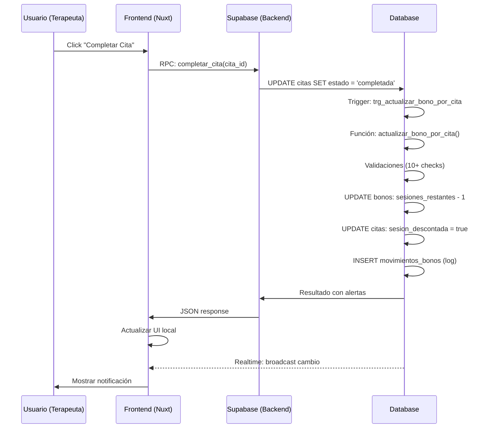

# 📚 Sistema de Citas y Bonos - Índice General

> **Sistema completo de gestión de citas con descuento automático de sesiones de bonos**

---

## 🎯 Visión General

Este sistema integra **Supabase (PostgreSQL)** con **Nuxt 3** para crear una solución robusta de gestión de citas para terapeutas, con las siguientes características:

✅ **Descuento automático** de sesiones del bono al completar citas  
✅ **Prevención de doble descuento** (idempotencia)  
✅ **Trazabilidad completa** de todos los movimientos  
✅ **Actualización en tiempo real** con Supabase Realtime  
✅ **Seguridad integrada** con RLS y validación de roles  
✅ **Interfaz moderna** con Vue 3 y Tailwind CSS  

---

## 📖 Documentación

### 🚀 Guías Rápidas (Start Here!)

| Guía | Descripción | Tiempo | Para Quién |
|------|-------------|--------|------------|
| **[Quickstart](./SISTEMA_CITAS_BONOS_QUICKSTART.md)** | Implementación en 5 minutos | ⏱️ 5 min | Desarrolladores con prisa |
| **[Guía Frontend](./SISTEMA_CITAS_BONOS_FRONTEND.md)** | Integración completa con Nuxt 3 | ⏱️ 15 min | Frontend developers |

### 📘 Documentación Completa

| Documento | Contenido | Nivel |
|-----------|-----------|-------|
| **[Guía Completa del Sistema](./SISTEMA_CITAS_BONOS_GUIA_COMPLETA.md)** | Arquitectura, componentes, casos de uso, troubleshooting | 🟢 Completo |
| **[Migración SQL](../supabase/migrations/20251028_sistema_citas_bonos_consolidado.sql)** | Código fuente del backend (tablas, funciones, triggers, RLS) | 🔴 Avanzado |

### 🧩 Componentes del Sistema

```
┌─────────────────────────────────────────────────────────────┐
│                    SISTEMA COMPLETO                          │
├─────────────────────────────────────────────────────────────┤
│                                                               │
│  ┌──────────────────┐         ┌──────────────────┐          │
│  │   BACKEND        │         │   FRONTEND       │          │
│  │   (Supabase)     │◄───────►│   (Nuxt 3)       │          │
│  └──────────────────┘         └──────────────────┘          │
│           │                            │                      │
│           │                            │                      │
│  ┌────────▼────────┐          ┌────────▼────────┐           │
│  │  Tablas         │          │  Composables    │           │
│  │  • citas        │          │  • useAgenda    │           │
│  │  • bonos        │          │                 │           │
│  │  • movimientos  │          │  Componentes    │           │
│  │  • pacientes    │          │  • AgendaTera.  │           │
│  │  • terapeutas   │          │                 │           │
│  └─────────────────┘          └─────────────────┘           │
│                                                               │
│  ┌─────────────────┐          ┌─────────────────┐           │
│  │  Funciones      │          │  Páginas        │           │
│  │  • actualizar_  │          │  • dashboard    │           │
│  │    bono_por_cita│          │  • agenda       │           │
│  │  • completar_   │          │                 │           │
│  │    cita         │          │                 │           │
│  │  • obtener_     │          │                 │           │
│  │    historial    │          │                 │           │
│  │  • verificar_   │          │                 │           │
│  │    bono_citas   │          │                 │           │
│  └─────────────────┘          └─────────────────┘           │
│                                                               │
│  ┌─────────────────┐                                         │
│  │  Triggers       │          📡 Supabase Realtime           │
│  │  • trg_actualiz │              (Auto-sync)                │
│  │    ar_bono_por  │                                         │
│  │    _cita        │                                         │
│  └─────────────────┘                                         │
│                                                               │
└─────────────────────────────────────────────────────────────┘
```

---

## 🗂️ Estructura de Archivos

```
📁 psicokarem/
├── 📁 supabase/
│   └── 📁 migrations/
│       └── 📄 20251028_sistema_citas_bonos_consolidado.sql
│
├── 📁 composables/
│   └── 📄 useAgenda.ts
│
├── 📁 components/
│   └── 📄 AgendaTerapeuta.vue
│
├── 📁 pages/
│   └── 📁 terapeuta/
│       ├── 📄 dashboard.vue
│       └── 📄 agenda.vue
│
└── 📁 docs/
    ├── 📄 SISTEMA_CITAS_BONOS_INDICE.md              ← Estás aquí
    ├── 📄 SISTEMA_CITAS_BONOS_QUICKSTART.md
    ├── 📄 SISTEMA_CITAS_BONOS_GUIA_COMPLETA.md
    └── 📄 SISTEMA_CITAS_BONOS_FRONTEND.md
```

---

## 🛠️ Tecnologías Utilizadas

### Backend
- **PostgreSQL** (via Supabase)
- **PL/pgSQL** (funciones y triggers)
- **Row Level Security (RLS)**
- **Realtime** (subscriptions)

### Frontend
- **Nuxt 3** (Vue 3 + Composition API)
- **TypeScript**
- **Tailwind CSS**
- **Supabase Client JS**

---

## 🚦 Flujo de Trabajo

### 1. Usuario Completa una Cita



### 2. Prevención de Doble Descuento

```typescript
// Primera vez
await completarCita('abc-123')
// ✅ Descuenta sesión: 8 → 7

// Segunda vez (mismo ID)
await completarCita('abc-123')
// ✅ Retorna: "ya_descontada" (no descuenta de nuevo)
```

### 3. Trazabilidad Completa

```sql
-- Ver historial de un bono
SELECT * FROM movimientos_bonos WHERE bono_id = 'uuid';

-- Resultado:
-- tipo_movimiento | sesiones_antes | sesiones_despues | fecha
-- descuento       | 8              | 7                | 2025-10-28 10:30
-- descuento       | 7              | 6                | 2025-10-25 15:00
-- creacion        | 0              | 8                | 2025-10-01 09:00
```

---

## 📊 Tablas Principales

| Tabla | Propósito | Campos Clave |
|-------|-----------|--------------|
| **citas** | Sesiones programadas | `paciente_id`, `terapeuta_id`, `bono_id`, `estado`, `sesion_descontada` |
| **bonos** | Control de sesiones | `sesiones_totales`, `sesiones_restantes`, `estado`, `paciente_id` |
| **movimientos_bonos** | Trazabilidad | `bono_id`, `cita_id`, `tipo_movimiento`, `sesiones_antes`, `sesiones_despues` |
| **pacientes** | Datos del cliente | `nombre_completo`, `email`, `terapeuta_id` |
| **terapeutas** | Datos del profesional | `nombre_completo`, `email` |

---

## 🔑 Funciones RPC Disponibles

### Para Frontend

| Función | Parámetros | Retorna | Descripción |
|---------|------------|---------|-------------|
| `completar_cita` | `p_cita_id: uuid` | `jsonb` | Marca cita como completada |
| `obtener_historial_bono` | `p_bono_id: uuid` | `table` | Lista movimientos del bono |
| `verificar_bono_citas` | `p_bono_id: uuid` | `jsonb` | Verifica estado y detecta inconsistencias |

### Internas (usadas por triggers)

| Función | Descripción |
|---------|-------------|
| `actualizar_bono_por_cita` | Descuenta sesión con todas las validaciones |
| `trigger_actualizar_bono_por_cita` | Ejecutada automáticamente por el trigger |

---

## ⚡ Inicio Rápido

### 1️⃣ Instalar Backend (2 min)

```bash
# Ejecutar migración en Supabase
cd psicokarem
supabase db push

# O desde Supabase Dashboard > SQL Editor
# Copiar y ejecutar: 20251028_sistema_citas_bonos_consolidado.sql
```

### 2️⃣ Verificar Instalación (30 seg)

```sql
SELECT * FROM public.verificar_sistema_citas_bonos();
```

Debe mostrar 6 componentes con `✅`.

### 3️⃣ Usar en Frontend (2 min)

```vue
<script setup>
import { useAgenda } from '~/composables/useAgenda'

const { citasDelDia, completarCita } = useAgenda()

const handleCompletar = async (citaId) => {
  await completarCita(citaId)
  alert('¡Cita completada!')
}
</script>

<template>
  <div>
    <h2>Citas de Hoy</h2>
    <div v-for="cita in citasDelDia" :key="cita.id">
      <p>{{ cita.paciente?.nombre_completo }}</p>
      <button @click="handleCompletar(cita.id)">Completar</button>
    </div>
  </div>
</template>
```

### 4️⃣ Componente Completo (10 seg)

```vue
<template>
  <AgendaTerapeuta />
</template>
```

**¡Listo!** 🎉

---

## 🎓 Aprende Más

### Rutas de Aprendizaje

#### 🟢 Principiante

1. Leer [Quickstart](./SISTEMA_CITAS_BONOS_QUICKSTART.md)
2. Ejecutar migración
3. Usar componente `<AgendaTerapeuta />`
4. Probar completar una cita

#### 🟡 Intermedio

1. Leer [Guía Frontend](./SISTEMA_CITAS_BONOS_FRONTEND.md)
2. Entender el composable `useAgenda`
3. Personalizar estilos y colores
4. Agregar notificaciones con toasts
5. Implementar filtros personalizados

#### 🔴 Avanzado

1. Leer [Guía Completa](./SISTEMA_CITAS_BONOS_GUIA_COMPLETA.md)
2. Estudiar la migración SQL
3. Entender triggers y funciones
4. Configurar RLS personalizado
5. Extender con nuevas funcionalidades

---

## 🔧 Casos de Uso Comunes

### Dashboard Simple

```vue
<script setup>
const { citasDelDia } = useAgenda()
</script>

<template>
  <div class="grid grid-cols-3 gap-4">
    <div v-for="cita in citasDelDia" :key="cita.id">
      {{ cita.paciente?.nombre_completo }}
    </div>
  </div>
</template>
```

### Alertas de Bonos

```vue
<script setup>
const { citasConBonoProximoAgotar } = useAgenda()
</script>

<template>
  <div v-if="citasConBonoProximoAgotar.length > 0" class="alerta">
    ⚠️ {{ citasConBonoProximoAgotar.length }} pacientes con pocas sesiones
  </div>
</template>
```

### Historial de Bono

```vue
<script setup>
const { obtenerHistorialBono } = useAgenda()
const historial = ref([])

const verHistorial = async (bonoId) => {
  historial.value = await obtenerHistorialBono(bonoId)
}
</script>

<template>
  <button @click="verHistorial('uuid')">Ver Historial</button>
  <div v-for="mov in historial" :key="mov.id">
    {{ mov.tipo_movimiento }}: {{ mov.sesiones_antes }} → {{ mov.sesiones_despues }}
  </div>
</template>
```

---

## 🚨 Troubleshooting Rápido

### Problema Común 1: No se cargan las citas

```typescript
// Verificar que el usuario esté autenticado
const user = useSupabaseUser()
console.log('Usuario:', user.value)

// Verificar RLS
// Supabase Dashboard > Database > Policies
```

### Problema Común 2: No descuenta la sesión

```sql
-- Verificar trigger activo
SELECT tgname, tgenabled FROM pg_trigger 
WHERE tgrelid = 'citas'::regclass;

-- Debe aparecer: trg_actualizar_bono_por_cita | O (enabled)
```

### Problema Común 3: Realtime no funciona

```typescript
// Habilitar Realtime en Supabase Dashboard
// Database > Replication > citas (enable)
```

---

## 📞 Soporte y Contribución

### ¿Encontraste un Bug?

1. Verifica la instalación con `verificar_sistema_citas_bonos()`
2. Revisa los logs de Supabase (Dashboard > Logs)
3. Consulta la sección [Troubleshooting](./SISTEMA_CITAS_BONOS_GUIA_COMPLETA.md#-troubleshooting)

### ¿Quieres Extender el Sistema?

1. Lee la [Guía Completa](./SISTEMA_CITAS_BONOS_GUIA_COMPLETA.md)
2. Estudia las funciones SQL existentes
3. Mantén la idempotencia y trazabilidad
4. Actualiza la documentación

---

## 📋 Checklist de Proyecto

### Backend
- [ ] Migración ejecutada
- [ ] Verificación pasada (6/6 componentes)
- [ ] Triggers activos
- [ ] RLS configurado
- [ ] Realtime habilitado

### Frontend
- [ ] Composable creado
- [ ] Componente importado
- [ ] Sistema de toasts configurado
- [ ] Página de agenda creada
- [ ] Probado en desarrollo

### Testing
- [ ] Crear cita
- [ ] Completar cita
- [ ] Verificar descuento
- [ ] Probar idempotencia (completar 2 veces)
- [ ] Ver historial
- [ ] Probar con última sesión

---

## 🎉 ¡Felicidades!

Ahora tienes un sistema completo, robusto y profesional de gestión de citas con bonos.

**Siguiente paso**: [Quickstart](./SISTEMA_CITAS_BONOS_QUICKSTART.md) → Implementar en 5 minutos

---

**Fecha de creación**: 28 de octubre de 2025  
**Versión**: 1.0.0  
**Sistema**: Psicokarem - Gestión de Citas y Bonos
