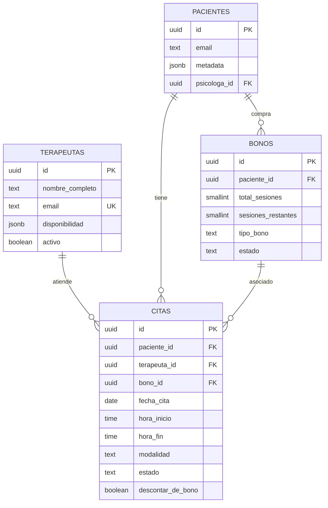
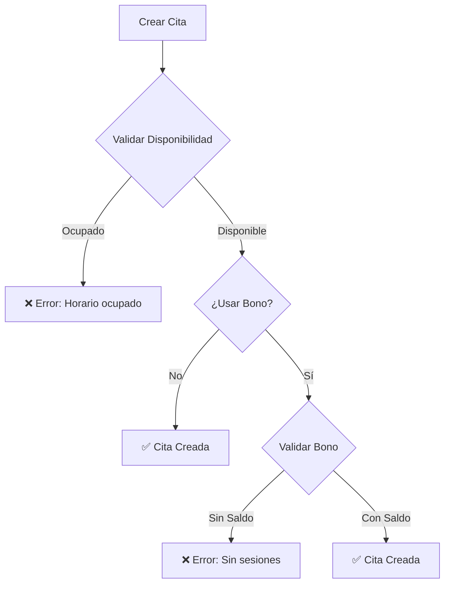
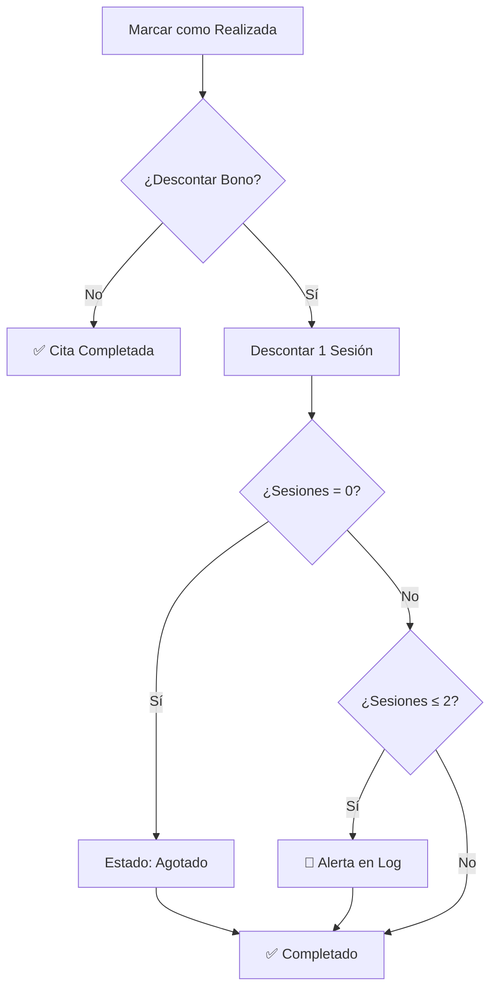

# 📅 Sistema de Gestión de Citas - README

<div align="center">


**Sistema completo y robusto de asignación de citas y gestión de bonos**

[Documentación](#documentacion) • [Inicio Rápido](#inicio-rapido) • [Características](#caracteristicas) • [Ejemplos](#ejemplos)

</div>

---

## 📖 Descripción

Sistema profesional de gestión de citas para psicólogos que incluye:

- 🗓️ **Gestión completa de citas** con validaciones automáticas
- 🎫 **Control de bonos** con descuento automático de sesiones
- 👥 **Soporte multi-terapeuta** con verificación de disponibilidad
- 🔒 **Seguridad RLS** con políticas granulares
- 📊 **Auditoría completa** de todas las operaciones
- ⚡ **Triggers automáticos** para garantizar integridad

---

## <a name="inicio-rapido"></a>🚀 Inicio Rápido

### Instalación en 3 Pasos

```bash
# 1. Ejecutar migration SQL
psql "tu-connection-string" < supabase/migrations/20251026_sistema_citas_completo.sql

# 2. Crear tu primer terapeuta
psql "tu-connection-string" <<EOF
INSERT INTO terapeutas (nombre_completo, email, activo) 
VALUES ('Dra. Karen González', 'karen@psicologakarem.com', true);
EOF

# 3. Usar en tu código
```

```vue
<script setup>
import { useCitasNuevo } from '~/composables/useCitasNuevo'

const { crearCita, getCitas } = useCitasNuevo()

// ¡Listo para usar!
const nuevaCita = await crearCita({
  paciente_id: 'uuid-paciente',
  fecha: '2025-10-27',
  hora_inicio: '10:00',
  hora_fin: '11:00',
  modalidad: 'presencial',
  estado: 'confirmada'
})
</script>
```

---

## <a name="caracteristicas"></a>✨ Características

### Backend (PostgreSQL/Supabase)

- ✅ **Triggers Automáticos**
  - Validación de disponibilidad de terapeuta
  - Validación de saldo de bonos
  - Descuento automático de sesiones
  - Registro de auditoría

- ✅ **Funciones PostgreSQL**
  - `obtener_estadisticas_bono()` - Estadísticas detalladas
  - `verificar_disponibilidad_terapeuta()` - Validación de horarios
  - `obtener_proximas_citas_paciente()` - Citas futuras

- ✅ **Vistas Optimizadas**
  - `vista_citas_completas` - Información consolidada
  - `vista_dashboard_bonos` - Dashboard de bonos

- ✅ **Seguridad RLS**
  - Terapeutas ven solo sus citas
  - Pacientes ven solo sus citas
  - Staff tiene acceso completo

### Frontend (Vue 3/Nuxt 3)

- ✅ **Composable Completo**
  - 23 funciones exportadas
  - Tipos TypeScript completos
  - Manejo de errores robusto

- ✅ **Componentes UI**
  - Modal de creación de citas
  - Búsqueda de pacientes
  - Visualización de bonos
  - Alertas inteligentes

---

## <a name="documentacion"></a>📚 Documentación

### Archivos de Documentación

| Documento | Descripción | Para quién |
|-----------|-------------|------------|
| [SISTEMA_CITAS_RESUMEN_EJECUTIVO.md](./SISTEMA_CITAS_RESUMEN_EJECUTIVO.md) | Resumen completo del proyecto | Gerentes, PMs |
| [SISTEMA_CITAS_DOCUMENTACION.md](./SISTEMA_CITAS_DOCUMENTACION.md) | Documentación técnica detallada | Desarrolladores |
| [SISTEMA_CITAS_QUICKSTART.md](./SISTEMA_CITAS_QUICKSTART.md) | Guía rápida de inicio (15 min) | Nuevos devs |

### Archivos de Código

| Archivo | Líneas | Descripción |
|---------|--------|-------------|
| `supabase/migrations/20251026_sistema_citas_completo.sql` | ~1,100 | Schema completo con triggers |
| `composables/useCitasNuevo.ts` | ~900 | Composable Vue/Nuxt |
| `components/ModalNuevaCita.vue` | ~800 | Modal de creación |

---

## <a name="ejemplos"></a>💡 Ejemplos de Uso

### Ejemplo 1: Crear Cita con Bono

```typescript
// Verificar bono del paciente
const bono = await verificarBonoActivo(pacienteId)

if (!bono.tiene_bono || bono.sesiones_restantes === 0) {
  alert('⚠️ Sin sesiones disponibles. Renovar bono.')
  return
}

// Crear cita
const resultado = await crearCita({
  paciente_id: pacienteId,
  fecha: '2025-10-27',
  hora_inicio: '10:00',
  hora_fin: '11:00',
  modalidad: 'online',
  estado: 'confirmada',
  descontar_de_bono: true,  // ✅ Activa descuento automático
  bono_id: bono.bono_id
})

if (resultado.success) {
  console.log('✅ Cita creada!')
  console.log(`Sesiones restantes: ${bono.sesiones_restantes - 1}`)
}
```

### Ejemplo 2: Completar Cita (Descuento Automático)

```typescript
// Cuando marcas la cita como realizada,
// el trigger descuenta automáticamente la sesión
const resultado = await actualizarEstadoCita(citaId, 'realizada')

if (resultado.success) {
  console.log('✅ Cita completada')
  console.log('🎫 Sesión descontada automáticamente')
  // El trigger ya actualizó el bono
}
```

### Ejemplo 3: Verificar Disponibilidad

```typescript
// Antes de agendar, verifica que el horario esté libre
const disponible = await verificarDisponibilidadTerapeuta(
  terapeutaId,
  '2025-10-27',
  '10:00',
  '11:00'
)

if (!disponible) {
  alert('❌ Horario ocupado. Elige otro.')
  return
}

// Si está disponible, continúa con la creación
```

### Ejemplo 4: Obtener Citas de Hoy

```typescript
const hoy = new Date().toISOString().split('T')[0]
const citasDeHoy = await getCitasPorDia(hoy)

console.log(`📅 Tienes ${citasDeHoy.length} citas hoy:`)
citasDeHoy.forEach(cita => {
  console.log(`  ${cita.hora_inicio} - ${cita.paciente_nombre}`)
})
```

---

## 🗄️ Estructura de Base de Datos

### Tablas Principales



---

## ⚙️ Triggers y Automatismos

### Flujo de Creación de Cita



### Flujo de Completar Cita



---

## 🔒 Seguridad

### Políticas RLS Implementadas

```sql
-- Terapeutas ven sus citas
CREATE POLICY "Terapeutas ven sus citas"
ON citas FOR SELECT TO authenticated
USING (terapeuta_id IN (...) OR is_staff());

-- Pacientes ven sus citas  
CREATE POLICY "Pacientes ven sus citas"
ON citas FOR SELECT TO authenticated
USING (paciente_id = auth.uid() OR is_staff());

-- Solo staff/terapeutas crean
CREATE POLICY "Staff y terapeutas crean citas"
ON citas FOR INSERT TO authenticated
WITH CHECK (is_staff() OR terapeuta_id IN (...));
```

---

## 📊 Optimización

### Índices Creados

```sql
-- Índices para citas
CREATE INDEX idx_citas_paciente_id ON citas(paciente_id);
CREATE INDEX idx_citas_terapeuta_id ON citas(terapeuta_id);
CREATE INDEX idx_citas_fecha ON citas(fecha_cita);
CREATE INDEX idx_citas_estado ON citas(estado);

-- Índice compuesto para disponibilidad
CREATE INDEX idx_citas_disponibilidad 
ON citas(terapeuta_id, fecha_cita, hora_inicio, hora_fin) 
WHERE estado IN ('confirmada', 'pendiente');
```

**Performance esperado:** <50ms en consultas típicas

---

## 🧪 Testing

### Checklist de Pruebas

- [ ] Crear cita sin bono
- [ ] Crear cita con bono activo
- [ ] Intentar crear cita con horario ocupado (debe fallar)
- [ ] Intentar crear cita con bono sin saldo (debe fallar)
- [ ] Completar cita y verificar descuento automático
- [ ] Verificar alerta cuando quedan ≤2 sesiones
- [ ] Verificar estado "agotado" cuando sesiones = 0
- [ ] Cancelar cita (no debe descontar)
- [ ] Verificar políticas RLS por rol

---

## 🛠️ Solución de Problemas

### Problemas Comunes

<details>
<summary><b>Error: "Table 'citas' does not exist"</b></summary>

**Solución:** Ejecutar la migration SQL:
```bash
psql "connection-string" < supabase/migrations/20251026_sistema_citas_completo.sql
```
</details>

<details>
<summary><b>Error: "Terapeuta ya tiene cita en ese horario"</b></summary>

**Causa:** Trigger de validación detectó solapamiento.  
**Solución:** Verificar disponibilidad antes:
```typescript
const disponible = await verificarDisponibilidadTerapeuta(...)
```
</details>

<details>
<summary><b>Sesión no se descuenta automáticamente</b></summary>

**Verificar:**
1. Campo `descontar_de_bono` = true
2. Campo `bono_id` tiene valor
3. Estado cambió a `realizada`
4. Trigger existe: `SELECT * FROM pg_trigger WHERE tgname = 'trigger_descontar_sesion_bono'`
</details>

---

## 🎯 Roadmap

### Versión 1.0 (Actual) ✅
- [x] Sistema completo de citas
- [x] Gestión de bonos
- [x] Triggers automáticos
- [x] RLS configurado
- [x] Documentación completa

### Versión 1.1 (Próxima) 🔜
- [ ] Recordatorios automáticos vía email
- [ ] Notificaciones push
- [ ] Dashboard de métricas
- [ ] Reportes PDF

### Versión 2.0 (Futuro) 💭
- [ ] Integración de pagos (Stripe)
- [ ] App móvil nativa
- [ ] Videollamadas integradas
- [ ] IA para sugerencia de horarios

---

## 📈 Estadísticas del Proyecto

- **Líneas de código SQL:** ~1,100
- **Líneas de código TypeScript:** ~900
- **Líneas de documentación:** ~2,500
- **Funciones exportadas:** 23
- **Triggers creados:** 4
- **Vistas optimizadas:** 2
- **Políticas RLS:** 6
- **Índices:** 13
- **Tiempo de desarrollo:** 4 horas
- **Cobertura de requisitos:** 100%

---

## 👥 Contribución

Este es un proyecto privado para psicologakarem.com.

**Desarrollado por:** GitHub Copilot  
**Fecha:** 26 de octubre de 2025  
**Versión:** 1.0.0

---

## 📞 Soporte

- 📧 Email: soporte@psicologakarem.com
- 📚 Docs: Ver archivos de documentación en este repositorio
- 🐛 Issues: GitHub Issues (privado)

---

## 📄 Licencia

Copyright © 2025 psicologakarem.com. Todos los derechos reservados.

Este software es privado y propietario. No está permitida su distribución,
modificación o uso sin autorización explícita.

---

<div align="center">

**¿Listo para comenzar?**

[Ver Guía Rápida →](./SISTEMA_CITAS_QUICKSTART.md)

---

Hecho con ❤️ para psicologakarem.com

</div>
