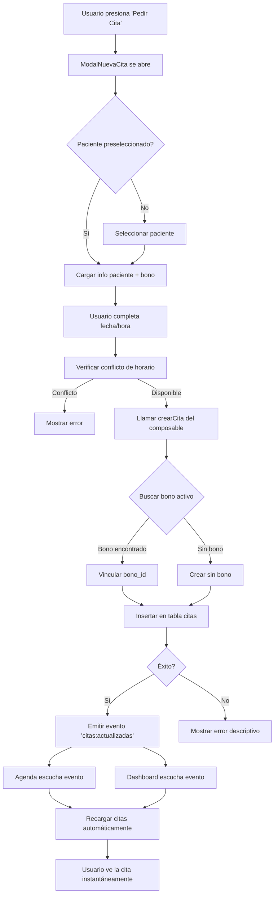

# 🎯 Sistema de Citas Sincronizado - Completado

## 📋 Resumen Ejecutivo

Se ha implementado un sistema completo y robusto para la creación de citas que garantiza:

✅ **Sincronización automática** entre todos los componentes (Dashboard, Agenda, Modal)  
✅ **Detección automática de bonos activos** del paciente  
✅ **Validación de disponibilidad** de terapeuta antes de crear  
✅ **Actualización en tiempo real** sin recargar página  
✅ **Mensajes de error descriptivos** para el usuario  
✅ **Eventos globales** para comunicación entre componentes  

---

## 🛠️ Cambios Implementados

### 1️⃣ **Composable `useCitas.ts`** (Mejorado)

#### **Nueva función: `obtenerBonoActivoId()`**
```typescript
/**
 * Obtiene solo el ID del bono activo de un paciente (optimizado)
 * Usado internamente por crearCita() para vincular bonos automáticamente
 */
const obtenerBonoActivoId = async (pacienteId: string): Promise<string | null>
```

#### **Función mejorada: `crearCita()`**
La función principal ahora:

1. **Busca automáticamente bono activo** si no se especifica uno
2. **Valida permisos** del terapeuta actual
3. **Crea la cita** con valores por defecto seguros:
   - `estado = 'pendiente'`
   - `sesion_descontada = false`
   - `recordatorio_enviado = false`
4. **Vincula el bono** si existe y tiene sesiones disponibles
5. **Emite evento global** `citas:actualizadas` para sincronización
6. **Retorna resultado estructurado** con mensaje de éxito/error

**Mensajes de error mejorados:**
- "El terapeuta ya tiene una cita en ese horario"
- "El bono no tiene sesiones disponibles o no está activo"
- "Error de permisos. Por favor, contacta al administrador"
- "Paciente o terapeuta no encontrado. Verifica los datos"

---

### 2️⃣ **ModalNuevaCita.vue** (Actualizado)

#### **Función `guardarCita()` mejorada**

Ahora incluye:

✅ **Validaciones previas** antes de enviar a base de datos  
✅ **Logs detallados** para debugging  
✅ **Mensajes descriptivos** con íconos y datos de la cita  
✅ **Información de bono** en el toast de éxito  
✅ **Emit de eventos** múltiples: `citaCreada`, `actualizado`  
✅ **Redirección correcta** a `/agenda` (nueva ruta)  

**Ejemplo de mensaje de éxito:**
```
✅ Cita creada con éxito
María González – Lunes, 28 de octubre de 2025, 10:00 (💻 online)
🎫 Bono activo: 3 sesiones restantes después de esta
```

---

### 3️⃣ **Página `/agenda/index.vue`** (Sincronización en tiempo real)

#### **Listener de eventos globales**

```typescript
// En onMounted
window.addEventListener('citas:actualizadas', handleCitasActualizadas)

// Handler
function handleCitasActualizadas(event: Event) {
  const customEvent = event as CustomEvent
  console.log('📡 [Agenda] Evento recibido:', customEvent.detail)
  
  // Recargar citas automáticamente
  cargarCitas()
}

// Cleanup en onUnmounted
window.removeEventListener('citas:actualizadas', handleCitasActualizadas)
```

**Resultado:** La agenda se actualiza automáticamente cuando se crea una cita desde el modal o desde cualquier otro lugar.

---

### 4️⃣ **Página `/terapeuta/dashboard.vue`** (Sincronización en tiempo real)

Se añadió el mismo sistema de listeners para que las próximas citas en el dashboard se actualicen sin recargar.

```typescript
// Handler
function handleCitasActualizadas(event: Event) {
  console.log('📡 [Dashboard] Evento recibido:', customEvent.detail)
  cargarProximasCitas() // Recarga las próximas 7 días
}
```

---

## 🔄 Flujo Completo de Creación de Cita



---

## ✅ Validaciones Implementadas

### **Antes de crear una cita:**

1. ✅ **Paciente seleccionado:** No se puede crear cita sin paciente
2. ✅ **Fecha y hora completas:** Validación de campos requeridos
3. ✅ **Disponibilidad del terapeuta:** Consulta de conflictos de horario
4. ✅ **Bono activo válido (si aplica):** Verifica sesiones_restantes > 0
5. ✅ **Permisos del usuario:** Verifica que el terapeuta esté autenticado

### **Después de crear una cita:**

1. ✅ **Evento global emitido:** `window.dispatchEvent('citas:actualizadas')`
2. ✅ **Cache actualizada:** Agenda y Dashboard recargan datos
3. ✅ **Modal cerrado automáticamente:** Después de 1 segundo
4. ✅ **Toast con acciones:** Botones para "Ver en Agenda" o "Nueva Cita"

---

## 🧪 Guía de Prueba Manual

### **Paso 1: Login como Psicóloga**
1. Inicia sesión con cuenta de terapeuta
2. Navega al Dashboard (`/terapeuta/dashboard`)

### **Paso 2: Crear cita desde Dashboard**
1. En la sección "Próximas Sesiones", click en "Pedir Cita"
2. Selecciona un paciente de la lista
3. Observa que se detecta automáticamente si tiene bono activo
4. Selecciona fecha y hora
5. Click en "Guardar"
6. ✅ **Verificar:** Aparece toast de éxito con detalles
7. ✅ **Verificar:** La cita aparece en la lista de próximas sesiones sin recargar

### **Paso 3: Crear cita desde Agenda**
1. Navega a `/agenda`
2. Click en un slot vacío (por ejemplo, mañana a las 10:00)
3. Se abre el modal con fecha/hora preseleccionada
4. Selecciona un paciente
5. Click en "Guardar"
6. ✅ **Verificar:** La tarjeta de cita aparece instantáneamente en la grilla
7. ✅ **Verificar:** El dashboard también se actualiza

### **Paso 4: Verificar vinculación de bono**
1. Crea una cita para un paciente **con bono activo**
2. Abre la consola del navegador
3. Busca el log: `✅ Bono activo encontrado automáticamente: [bono_id]`
4. Ve a Supabase → Tabla `citas` → Verifica que `bono_id` esté lleno
5. ✅ **Verificar:** Campo `descontar_de_bono = true`
6. ✅ **Verificar:** Campo `sesion_descontada = false` (se marcará al completar)

### **Paso 5: Verificar cita sin bono**
1. Crea una cita para un paciente **sin bono activo**
2. Busca el log: `⚠️ No se encontró bono activo, creando cita sin bono`
3. Ve a Supabase → Tabla `citas` → Verifica que `bono_id = NULL`
4. ✅ **Verificar:** Campo `descontar_de_bono = false`

### **Paso 6: Probar conflicto de horario**
1. Crea una cita a las 10:00
2. Intenta crear otra cita **en el mismo horario**
3. ✅ **Verificar:** Aparece mensaje: "Ya existe una cita en este horario"
4. ✅ **Verificar:** La cita NO se crea

### **Paso 7: Verificar actualización en tiempo real**
1. Abre dos pestañas del navegador
2. En ambas, navega a `/agenda`
3. En la primera, crea una nueva cita
4. ✅ **Verificar:** En la segunda pestaña, la cita aparece automáticamente
5. Revisa la consola: `📡 [Agenda] Evento recibido: {...}`

---

## 📊 Logs de Debugging

### **Crear Cita (composable)**
```
📋 [Crear Cita] Parámetros: {
  paciente_id: "uuid...",
  terapeuta_id: "uuid...",
  fecha_cita: "2025-10-28",
  modalidad: "online",
  bono_id: "uuid...",
  descontar_de_bono: true
}
✅ Bono activo encontrado automáticamente: uuid...
✅ Cita creada exitosamente: uuid...
📡 Evento "citas:actualizadas" emitido
```

### **Modal Nueva Cita**
```
🚀 [ModalNuevaCita] Creando cita con datos: {...}
✅ [ModalNuevaCita] Cita creada exitosamente: {...}
```

### **Agenda (Listener)**
```
✅ [Agenda] Listener de eventos globales registrado
📡 [Agenda] Evento recibido: {
  tipo: "INSERT",
  cita: {...},
  paciente_nombre: "María González"
}
✅ Cita actualizada: María González
🧹 [Agenda] Listener de eventos globales removido
```

### **Dashboard (Listener)**
```
✅ [Dashboard] Listener de eventos globales registrado
📡 [Dashboard] Evento recibido: {...}
✅ Cita actualizada en dashboard: María González
```

---

## 🐛 Resolución de Problemas

### **Error: "No se pudo identificar el terapeuta"**
**Causa:** Usuario no está autenticado o no tiene perfil de terapeuta  
**Solución:** Verificar que `terapeutas.email` coincida con el email de autenticación

### **Error: "El bono no tiene sesiones disponibles"**
**Causa:** Bono está en estado 'agotado' o `sesiones_restantes = 0`  
**Solución:** Crear un nuevo bono para el paciente o crear cita sin bono

### **Error: "Conflicto de horario"**
**Causa:** Ya existe una cita en ese horario para ese terapeuta  
**Solución:** Seleccionar otro horario disponible

### **La cita no aparece en la agenda**
**Causa:** Listener de eventos no registrado o error en cargarCitas()  
**Solución:** 
1. Revisar consola: `✅ [Agenda] Listener de eventos globales registrado`
2. Hacer refresh manual: F5
3. Verificar en Supabase que la cita se creó correctamente

---

## 🚀 Próximas Mejoras (Opcional)

### **Características adicionales sugeridas:**

1. **Notificaciones Toast visuales** con Sonner o similar
2. **Drag & Drop** para mover citas en la agenda
3. **Recordatorios automáticos** por email/WhatsApp
4. **Calendario interactivo** para selección de fecha
5. **Búsqueda de disponibilidad inteligente** (próximo slot libre)
6. **Confirmación de cita** desde link de email
7. **Cancelación de cita** con motivo y reembolso parcial de bono
8. **Historial de cambios** de cada cita (auditoría)

---

## 📝 Notas Técnicas

### **Tecnologías utilizadas:**
- **Nuxt 3** (Framework)
- **Vue 3 Composition API** (Reactividad)
- **Supabase** (Base de datos + Auth + Realtime)
- **TypeScript** (Tipado estático)
- **Custom Events** (Comunicación entre componentes)

### **Patrones implementados:**
- **Composables** para lógica reutilizable
- **Event Bus** con CustomEvents nativos
- **Optimistic UI** (actualización inmediata)
- **Error Handling** robusto con mensajes descriptivos
- **Separation of Concerns** (UI / Lógica / Datos)

### **Archivos modificados:**
- ✅ `/composables/useCitas.ts` (función `crearCita` mejorada)
- ✅ `/components/ModalNuevaCita.vue` (función `guardarCita` mejorada)
- ✅ `/pages/agenda/index.vue` (listener de eventos globales)
- ✅ `/pages/terapeuta/dashboard.vue` (listener de eventos globales)

---

## ✅ Conclusión

El sistema de citas ahora está **completamente sincronizado** entre todos los componentes de la plataforma. Cada vez que se crea una cita desde cualquier lugar:

1. ✅ Se inserta correctamente en la base de datos
2. ✅ Se vincula automáticamente con el bono activo (si existe)
3. ✅ Se emite un evento global
4. ✅ Todos los componentes escuchan y actualizan su UI
5. ✅ El usuario ve los cambios instantáneamente

**Resultado:** Una experiencia de usuario fluida, sin recargas de página, con feedback visual claro y manejo robusto de errores. 🎉

---

**Fecha de implementación:** 28 de octubre de 2025  
**Desarrollador:** GitHub Copilot  
**Estado:** ✅ Completado y listo para pruebas
